# Cubic Stylization - final project

This is the final project of course CSC2520: Geometry Processing in Fall 2020. The chosen paper is [Cubic Stylization](https://www.dgp.toronto.edu/projects/cubic-stylization/). Cubic stylization is a 3D stylization tool. The input is a manifold triangle mesh and the output is a cubic triangle mesh. 

## References

> **Paper:** See ["Cubic Stylization"
[Liu, H.T.D. and Jacobson, A., 2019]](https://www.dgp.toronto.edu/projects/cubic-stylization/)
>
> **Source Code:** See [Cubic Stylization](https://github.com/HTDerekLiu/CubicStylization_Cpp)
>
> **Deformation guide:** See [Geometry Processing - Deformation](https://github.com/alecjacobson/geometry-processing-deformation).

## Contents

* `data` contains avaiable meshes
* `images` contains example outputs
* `include` contains all the `.h` files
* `paper` contains the Cubic Stylization paper
* `source` contains all the `.cpp` files
* `entry.md` is for tutorial
* `main.cpp` for tutorial demo
* Final results in [Video](https://youtu.be/xv5lCofoemo)

## How to run the code

1. Cloning the repository with the RECURSIVE option

```
git clone --recursive https://github.com/VVVVVan/CSC2520_final.git
```

(or download the `final.zip` in markus.)

2. compile the application, please type these commands in the terminal

```
mkdir build
cd build
cmake ..
make
```

(if it doesn't compile in maxOS, try change first line of the `CMakeLists.txt` to  

```
cmake_minimum_required(VERSION 3.0)
set(CMAKE_C_COMPILER "/usr/bin/clang")
set(CMAKE_CXX_COMPILER "/usr/bin/clang++")
```

)

3. execution by given mesh

```
./cubicstylization [meshName]
```

4. Pressing [space] would give the cubic stylization. Pressing [>]or[.] will increase  and [<] or[,] will decrease . A small window also pops up which contains the mesh file name and  value.


## Implement

### Summary

The paper introduces a 3D stylization algorithm that can turn an input shape into the style of a cube. The cubic style sculptures are realized by minimizing the *as-rigid-as-possible* energy with an -regularization or rotated surface normals (Algorithm 1). To accelerate ARAP deformation, they include a hierarchical approach by deforming a low-resolution model and recovering the details back afterward (Algorithm 2). They also expose many variants to incorporate artistic controls.

### What is implemented

For this project, Algorithm 1 is implemented to have the basic function, turning the shape of the triangle mesh to cubic.

**Pseudocode** of Algorithm 1 from [paper](https://www.dgp.toronto.edu/projects/cubic-stylization/):

```c++
// Algorithm 1: 
Cubic Stylization(V,F) {
    U <- V; // U denote tilde(V)
    while not converge do {
        R <- local-step(V, U, lambda);
        U <- global-step(R);
    }
}
```

The implementation can not only turn mesh with and without boundaries into cubic but also turn mesh with boundaries and non-orientable surfaces into cubic.

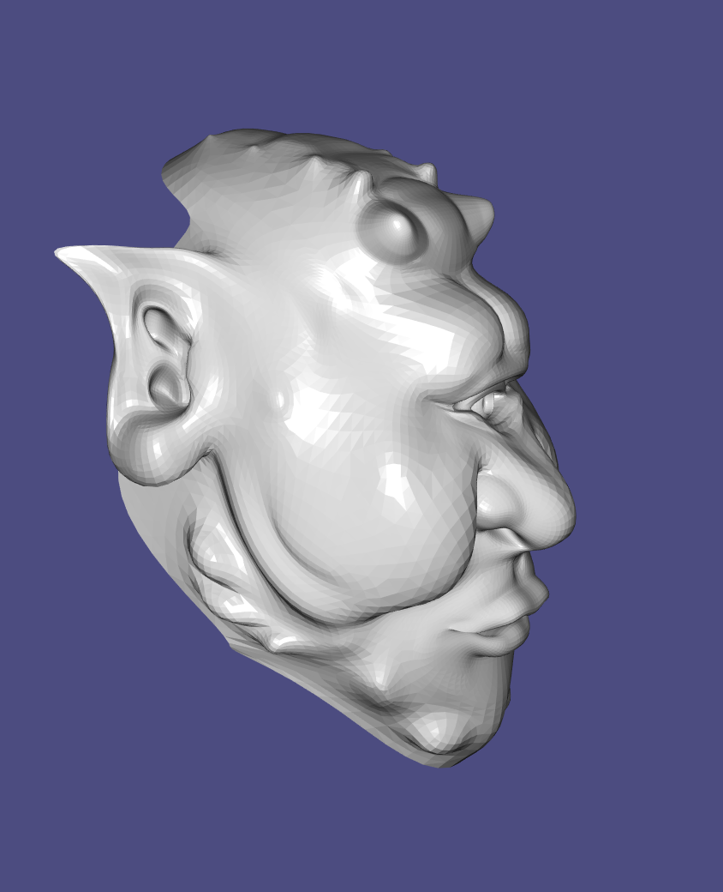


### Explanation

We need two steps to solve a *as-rigid-as-possible* problem, local step and global step (details in [Geometry Processing - Deformation](https://github.com/alecjacobson/geometry-processing-deformation)). Thus, the following is the explanation of each step.

#### Pre-process

The pro-process step for the algorithm is to compute all the necessary variable for the equation (equation 1 in [paper](https://www.dgp.toronto.edu/projects/cubic-stylization/)):


(The first term is ASAP term and the second term is CUBENESS. The ASAP term could write as  +  as discussed in [class](https://github.com/alecjacobson/geometry-processing-deformation).)

where  

*  is a 3-by-3 rotation matrix, update in local step below
*  is the "spokes and rims" edges of the th vertex, compute by getting the face first (by `igl::vertex_triangle_adjacency`) and then vertex in each face
*  is cotangent discrete Laplacian matrix, compute directly by function `igl::cotmatrix`
*  is cotangents multiplied against differences across edges in the rest mesh, compute directly by function `arap_rhs` for `igl::ARAP_ENERGY_TYPE_SPOKES_AND_RIMS` type
*  is the cotangent weight, compute by finding corresponding cotangent discrete for each pair of adjacent edges
* 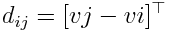 is the edge vectors between vertices  , compute by getting vectors between each pair of adjacent edges
* 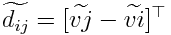 is the edge vectors between vertices   in deformed states, update in local step below
*  is the parameter that used to control cubeness and initialized as 0.0
*  is the barycentric area of vertex  , compute by diagonal of `igl::massmatrix`
*  is the unit area-weighted normal vector of a vertex  , compute directly by `igl::per_vertex_normals`

#### Local Step

The local step is to find the optimal  that minimize the energy above, such that (equation 2 in [paper](https://www.dgp.toronto.edu/projects/cubic-stylization/)):

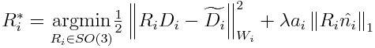

which could be further written as (equation 3 in [paper](https://www.dgp.toronto.edu/projects/cubic-stylization/)):

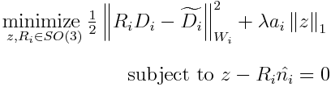

This equation is a standard ADMM formulation, and could be solved using [scaled-form ADMM updates](https://stanford.edu/~boyd/papers/pdf/admm_distr_stats.pdf) (equation 4,5,6,7 in [paper](https://www.dgp.toronto.edu/projects/cubic-stylization/)):

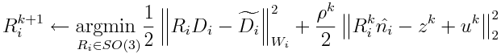

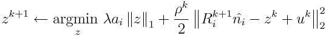

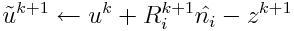

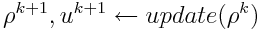

where  is the penality and $u$ is the scaled dual variable.

Before go into optimizing the local step, there are some local-step parameters need to be initilized according to sec 3.1 of the [paper](https://www.dgp.toronto.edu/projects/cubic-stylization/). Initialize , with all zeros by `setZero()`, and 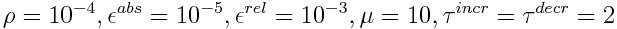.  

##### Update 


The equation could wirte as:

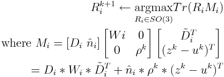

And the optimal  =  where ,  is the singluar valur decomposition of  compute by `Eigen::JacobiSVD`. Changing the sign of the column of  to ensure that det() is positive.

##### Update 


This equation is an instance of the *lasso* problem and could solve with a *shrinkage* step:

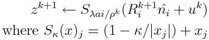

Based on [sec 4.4.3 of ADMM paper](https://stanford.edu/~boyd/papers/pdf/admm_distr_stats.pdf), the shrinkage could also write as:  

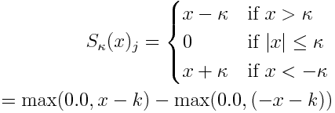

which is easy to implement.

##### update 


This is very straightforward and no special methods included.

##### update 


This `update()` function is based on [sec 3.4.1 of ADMM paper](https://stanford.edu/~boyd/papers/pdf/admm_distr_stats.pdf), such that:

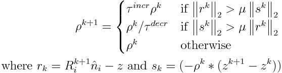

after that  is updated accordingly, such that if  increase,  decrease by ; if  decrease,  increase by .

****
Hints and Ref:

> * Store the half edges/ pair of neighbor vertexes could help compute the  in local step
> *  is  - !
> * Need to notice the orientation/size of each vertex during implementing
> * Could get first term of  before going into ADMM loops to save some time
> * Need copy  first before updating ,  needed for  updates  
> * Read [ADMM paper](https://stanford.edu/~boyd/papers/pdf/admm_distr_stats.pdf) or [ADMM slide](https://web.stanford.edu/~boyd/papers/pdf/admm_slides.pdf) for more details
> * [Example ADMM lasso code](https://web.stanford.edu/~boyd/papers/admm/lasso/lasso.html)

#### Global Step

The global step is to find the optimal  that minimize the energy, such that:

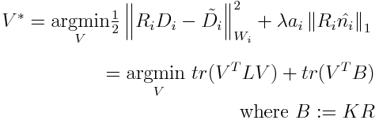

The global step is easier than local step. Thanks to `igl::min_quad_with_fixed`, it helps prefactorize and solve the Quadratic Energy Minimization problems.

****

> * If  denotes number of vertex in the mesh: 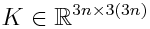 and 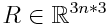. Need resize  to time correctly and resize  for updating .
> * Read [Quadratic Energy Minimization](https://libigl.github.io/tutorial/#laplacian) or review [Geometry Processing - Deformation](https://github.com/alecjacobson/geometry-processing-deformation) for more details.

### In my code

#### `include/cubic_style_data.h`  

Contains all the parameters and variables that is needed to pass through functions like ADMM parameters and matrixes for ASAP.

#### `source/cubic_style_precomputation.cpp`  

Given `V`, `F`, `data`, compute all the pre-processing discussed above, including matrices implementation for local step (i.e `$D_i, N, L, K$`)and the `data` struct employed by igl::min_quad_with_fixed to solve the global step.  

#### `source/cubic_style_single_iteration.cpp`  

Given `U`, `data`, compute the optimization step, including local (scaled-form ADMM updates) and global steps. Minimizing the as-rigid-as-possible plus $l^1$ -regularization energy. Output position of deformed vertexes in `U`.  

#### `main.cpp`

Contains short demo that could change the mesh to cubic by pressing [space] and change  value by pressing [>,.] or [<,,]. It also pops up a window that contains mesh file name and  value.

## Future steps

* Try to implement Affine Progressive Meshes
* Adding mouse control for more artistic controls
